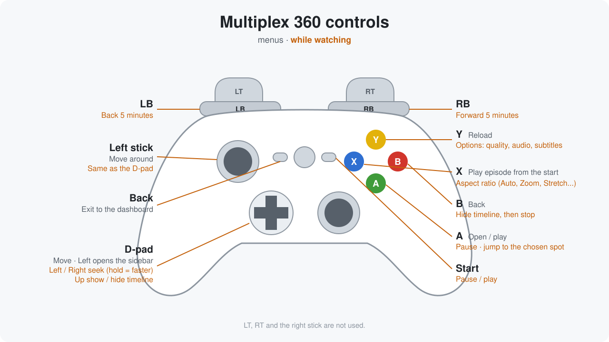

# Multiplex 360

An unofficial Plex client for RGH/JTAG Xbox 360 consoles.

- Sign in with a plex.tv/link code, Plex Home profiles
- Works at home, over the internet and through Plex Relay
- H.264 up to 720p plays directly on the console (FFmpeg with VMX128 code); anything else
  is converted by your Plex server
- Audio and subtitle tracks, quality presets, resume and watched state

## Install

1. Download `Multiplex360-x.y.zip` from [Releases](../../releases) and unzip it.
2. Copy the `Multiplex360` folder to your console (HDD or USB), with FTP or a USB stick.
3. Start `default.xex` from Aurora, FreeStyle or any dashboard that runs homebrew.
4. A code appears on screen. Go to [plex.tv/link](https://plex.tv/link) on your phone or PC
   and enter it.
5. Pick your profile if your account has more than one. Done.

The app only writes inside its own folder. To sign out, use Settings or delete `auth.ini`.

## Controls

## Building

Needs the Xbox 360 XDK (2.0.21256) and Visual Studio 2010 SP1: `tools\build.ps1`.

## Credits

- [FFmpeg](https://ffmpeg.org) 0.7, from the FFPlay360 port
- [mbedTLS](https://github.com/Mbed-TLS/mbedtls) 2.16
- [Inter](https://rsms.me/inter/) font (SIL Open Font License)

Not affiliated with Plex, Inc. or Microsoft. Licensed under the GPLv3.
