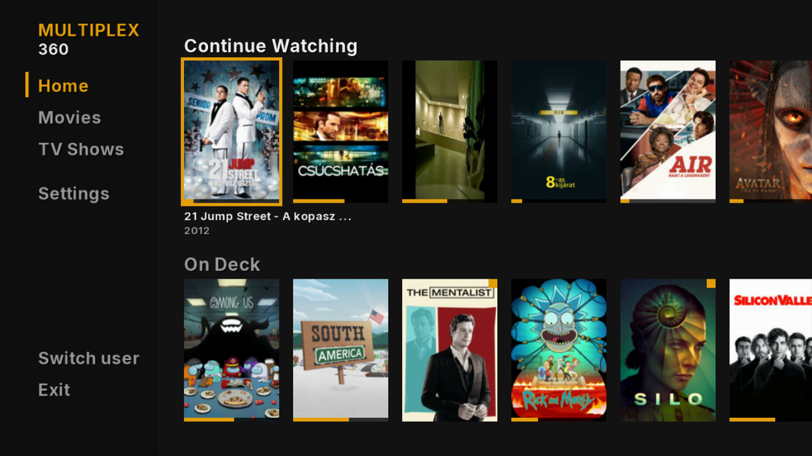

# Multiplex 360

An unofficial Plex client for RGH/JTAG Xbox 360 consoles.

- Sign in with a plex.tv/link code, Plex Home profiles
- Works at home, over the internet and through Plex Relay
- H.264 up to 720p plays directly on the console (FFmpeg with VMX128 code); anything else
  is converted by your Plex server
- Audio and subtitle tracks, quality presets, resume and watched state

## Install

Download the zip from Releases, copy the `Multiplex360` folder anywhere on the console and
start `default.xex` from Aurora or another homebrew dashboard. The app only writes inside its
own folder.

## Controls

| | |
|---|---|
| Browsing | D-pad / stick, A open, B back, Left opens the sidebar |
| Player | A pause, Left/Right seek (hold to go faster), Up timeline, Y options, B back |

## Building

Needs the Xbox 360 XDK (2.0.21256) and Visual Studio 2010 SP1: `tools\build.ps1`.

## Credits

- [FFmpeg](https://ffmpeg.org) 0.7, from the FFPlay360 port
- [mbedTLS](https://github.com/Mbed-TLS/mbedtls) 2.16
- [Inter](https://rsms.me/inter/) font (SIL Open Font License)

Not affiliated with Plex, Inc. or Microsoft. Licensed under the GPLv3.
